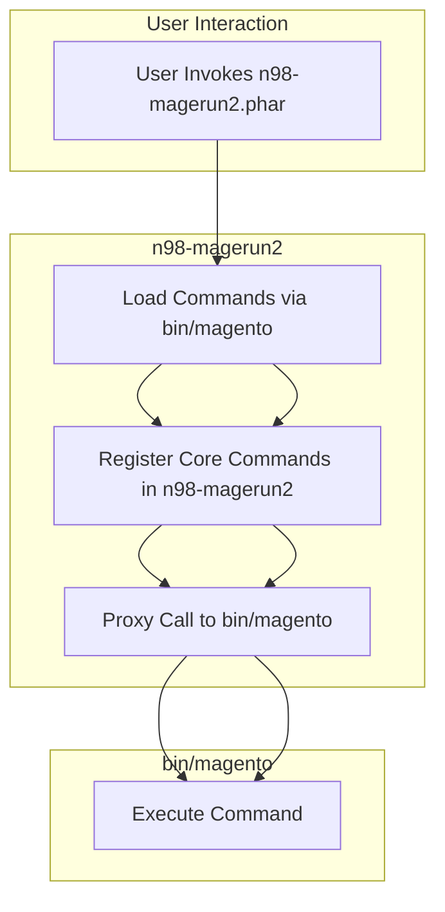

The MagentoCoreProxyCommand class in the n98-magerun2 tool serves as a proxy to execute native Magento 2 commands.

```mermaid
graph TD
  A[User Invokes n98-magerun2.phar] --> B[Load Commands via bin/magento]
  B --> C[Register Core Commands in n98-magerun2]
  C --> D[Proxy Call to bin/magento]
  D --> E[Execute Command]
  
  subgraph "User Interaction"
    A
  end
  
  subgraph "n98-magerun2"
    B --> C --> D
  end
  
  subgraph "bin/magento"
    D --> E
  end
```
