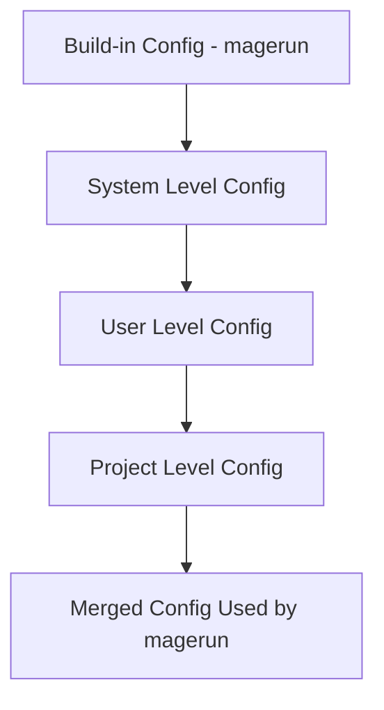

The configuration in n98-magerun2 is merged from several sources in a specific order. This allows for flexible overrides at different levels.

## Config Merge Order

Configs are merged in the following order:

- Build-in config (delivered by magerun)
- System level config
- User level config
- Project level config

Each subsequent config can override values from the previous one. The final result is the merged config used by magerun.

### Visualization

## Inspecting the Merged Config

To verify which config is loaded, you can use the command [`magerun:config:dump`](../command-docs/magerun/magerun-config-dump.md).

The command [`magerun:config:info`](../command-docs/magerun/magerun-config-info.md) shows the merged config and the source of each config value.
